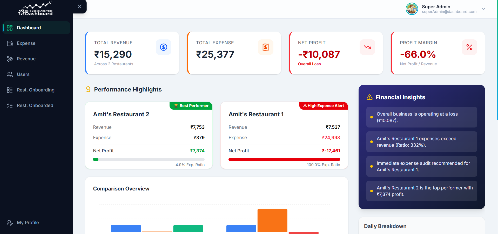
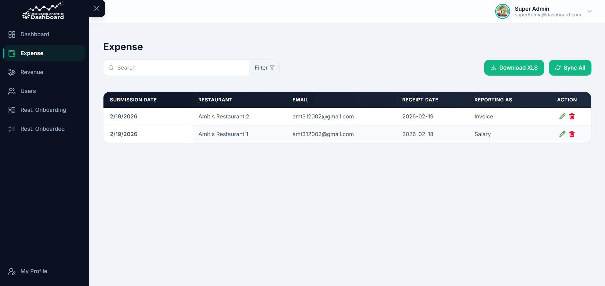
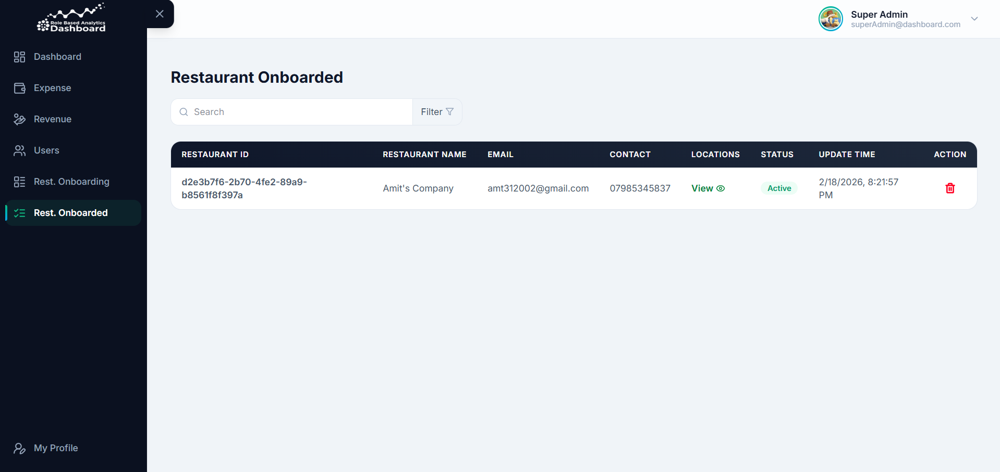
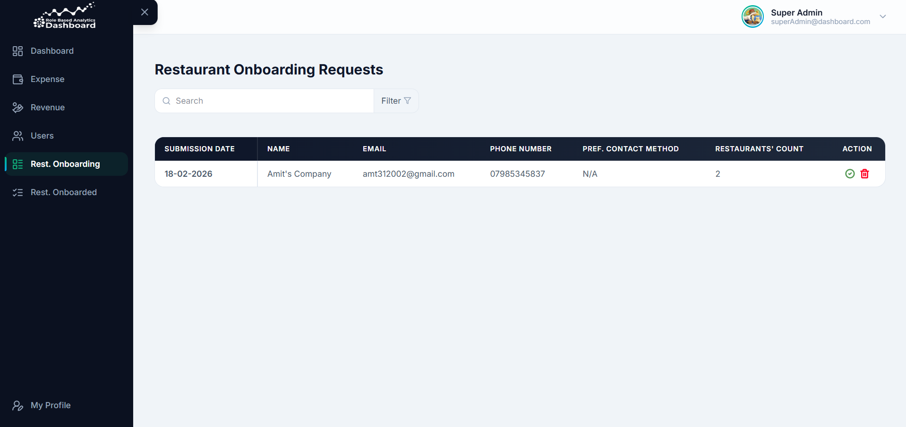
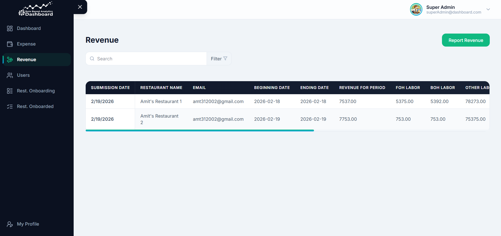
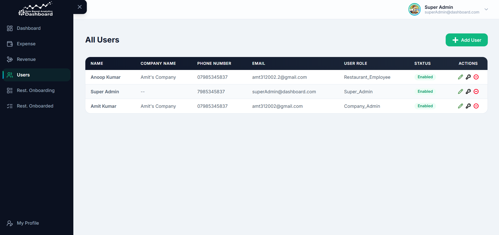

# 🍽️ Restaurant Operations Dashboard

> **Enterprise-Grade Multi-Tenant RBAC SaaS** - A comprehensive platform for streamlined restaurant operations, financial tracking, and role-based analytics.

[](https://react.dev/)
[](https://vitejs.dev/)
[](https://redux-toolkit.js.org/)
[](https://tailwindcss.com/)
[](https://www.docker.com/)
[](https://github.com/Anoop-Kumar-31/Role-Based-Analytics-Dashboard)
---

## 📖 Overview

The **Restaurant Operations Dashboard** is a sophisticated multi-tenant SaaS application designed to empower restaurant groups with data-driven insights. It bridges the gap between daily operations and high-level financial oversight, providing a unified platform for employees, managers, and executives.

Built with a focus on **scalability, security, and performance**, this dashboard showcases modern frontend architecture using React 19 and Vite, integrated with a robust role-based access control (RBAC) system.

> **Note:**
> This is a high-fidelity demonstration project. While the frontend and business logic are fully implemented, data persistence is handled via a service layer that can be connected to any compatible REST API.

---
## 📸 Visual Tour (Super Admin)


### Dashboard - Stats & Charts Overview Section


### Expense Management Section


### Onboarded Companies Section


### Onboarding Management Section


### Revenue Management Section


### User Management Section


---

## ✨ Key Features

### 🔐 Multi-Tenant RBAC System
The application features three specialized portals, each tailored to specific operational needs:
- **👑 Super Admin**: Global oversight, company onboarding, and cross-tenant user management.
- **🏢 Restaurant Admin**: Multi-unit management, staff oversight, and deep financial P&L analysis.
- **🧑‍🍳 Restaurant Employee**: Daily operations, real-time expense reporting, and revenue entry.

### 📈 Financial Intelligence
- **COGS Tracking**: Advanced invoice management system with smart categorization.
- **Revenue Analytics**: Real-time sales tracking and performance trends.
- **BlueBook (P&L)**: Industry-standard operational logging for comprehensive P&L reporting.
- **Risk Assessment**: Anomaly detection and expense-to-revenue ratio monitoring.

### 🌐 Scalable Infrastructure
- **Containerized Workflows**: Fully Docker-ready with multi-stage builds and Nginx orchestration.
- **Automatic SSL**: Integrated HTTPS support with automated certificate handling.
- **Modular Services**: Decoupled API layer for easy integration with backend systems.

---

## 🛠 Tech Stack

| Layer | Technologies |
| :--- | :--- |
| **Frontend Core** | React 19.1.0, Vite 6.3.5 |
| **State Management** | Redux Toolkit, Redux Persist |
| **Styling** | TailwindCSS 4.1.8, Lucide React, React Icons |
| **Networking** | Axios (with Interceptors), JWT-Based Auth |
| **Infrastructure** | Docker, Docker Compose (Optional)|

---

## 📂 Project Architecture

```bash
restaurant-ops-dashboard/
├── public/                # Static assets & Manifest
├── src/
│   ├── components/        # UI System (Table, Popup, Sidebar, etc.)
│   ├── layouts/           # Structure wrappers for different portals
│   ├── pages/             # Feature views (Super Admin, Admin, Employee)
│   ├── services/          # API & Business Logic layer
│   │   ├── modules/       # Domain-specific services (Expense, Revenue)
│   │   └── apiClient.js   # Centralized Axios configuration
│   ├── store/             # Global State (Auth, Preferences)
│   └── index.jsx          # App Entry Point
├── nginx/                 # Web server configuration (Optional)
├── docker-compose.yml     # Orchestration (Optional)
└── dockerfile             # Multi-stage production build (Optional)
```

---

## 🚀 Quick Start

### 1. Prerequisites
- **Node.js** 18.x or later
- **npm** 9.x or later
- **Docker** (Optional, for containerized deployment)

### 2. Installation
```bash
# Clone the repository
git clone https://github.com/Anoop-Kumar-31/Role-Based-Analytics-Dashboard.git

# Navigate to project
cd Role-Based-Analytics-Dashboard

# Install dependencies
npm install
```

### 3. Running Locally
```bash
# Start development server
npm run start
```
The app will be available at `http://localhost:3000`.

### 4. Production Build (Docker) (Optional)
```bash
# Spin up production-ready environment
docker compose up --build
```
Access the dashboard securely at `https://localhost`.

---

## 🎨 Professional Standard

> **Note: Enterprise React Patterns**
> 
* **Atomic Design**: Highly reusable, tested UI components.
* **Service Abstraction**: Logic-free components via specialized service modules.
* **Token Management**: Secure, persistent JWT handling with automatic expiration logic.
* **Mobile-First**: Fully responsive layouts using Tailwind's layout engine.

---

## 👨‍💻 Author - **Anoop Kumar**
- **GitHub**: [@Anoop-Kumar-31](https://github.com/Anoop-Kumar-31)
- **Portfolio**: [Anoop Kumar Portfolio](https://myportfolio-kto7.onrender.com/)

---
*Created for portfolio demonstration purposes.*